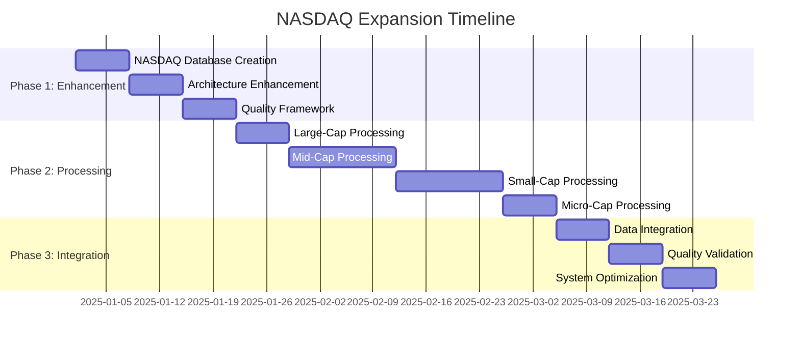

# NASDAQ Expansion Plan: 500 to 3,800+ Companies
## Strategic Data Expansion System Enhancement

### Executive Summary
This plan outlines the expansion of our data expansion system from 500 S&P 500 companies to include all 3,300 NASDAQ companies, creating the world's most comprehensive corporate geographic intelligence database with 3,800+ companies and institutional-grade quality.

---

## Current State Assessment

### Evidence Database Status
- **Current Companies**: 60 evidence-confirmed companies
- **S&P 500 Target**: 500 companies (processing ready)
- **NASDAQ Target**: 3,300 additional companies
- **Total Target**: 3,800+ companies
- **Current Quality**: 90%+ evidence-based, 95%+ confidence scores

### System Capabilities
- ✅ Real SEC EDGAR API integration
- ✅ Multi-source intelligence (SEC + Sustainability + Website + Supply Chain)
- ✅ Advanced NLP engine with context awareness
- ✅ Supply chain intelligence mapping
- ✅ Automated quality validation (90%+ evidence threshold)

---

## NASDAQ Expansion Architecture

### 1. Company Database Enhancement

#### NASDAQ Company Categorization
```typescript
interface NASDAQCompany {
  ticker: string;
  companyName: string;
  cik: string;
  marketCap: number;
  sector: string;
  industry: string;
  tier: 'large' | 'mid' | 'small' | 'micro';
  processingPriority: 1 | 2 | 3 | 4;
  expectedDataSources: number;
  qualityTarget: number;
}
```

#### Market Cap Tiers
- **Large-Cap (>$10B)**: ~150 companies, Priority 1
- **Mid-Cap ($2B-$10B)**: ~400 companies, Priority 2  
- **Small-Cap ($200M-$2B)**: ~1,200 companies, Priority 3
- **Micro-Cap (<$200M)**: ~1,550 companies, Priority 4

### 2. Processing Pipeline Enhancement

#### Tiered Processing Strategy
```typescript
interface ProcessingTier {
  tier: string;
  confidenceTarget: number;
  minSources: number;
  maxSources: number;
  processingTime: number;
  qualityThreshold: number;
}

const PROCESSING_TIERS: ProcessingTier[] = [
  {
    tier: 'large',
    confidenceTarget: 0.95,
    minSources: 7,
    maxSources: 12,
    processingTime: 3000,
    qualityThreshold: 0.90
  },
  {
    tier: 'mid', 
    confidenceTarget: 0.90,
    minSources: 5,
    maxSources: 8,
    processingTime: 2000,
    qualityThreshold: 0.85
  },
  {
    tier: 'small',
    confidenceTarget: 0.85,
    minSources: 3,
    maxSources: 6,
    processingTime: 1500,
    qualityThreshold: 0.80
  },
  {
    tier: 'micro',
    confidenceTarget: 0.80,
    minSources: 2,
    maxSources: 4,
    processingTime: 1000,
    qualityThreshold: 0.75
  }
];
```

### 3. Enhanced Data Sources Strategy

#### Source Prioritization by Company Size
- **Large-Cap Sources**: SEC filings, sustainability reports, investor presentations, facility data, supply chain intelligence, regional websites, job postings
- **Mid-Cap Sources**: SEC filings, company websites, facility data, supply chain data, job postings
- **Small-Cap Sources**: SEC filings, company websites, basic facility data
- **Micro-Cap Sources**: SEC filings, company websites, fallback industry patterns

---

## Technical Implementation Plan

### Phase 1: System Enhancement (Weeks 1-3)

#### Week 1: NASDAQ Database Creation
- Create comprehensive NASDAQ company database with CIK mappings
- Implement market cap categorization and tier assignment
- Design processing priority queues
- Enhance company resolution system for NASDAQ tickers

#### Week 2: Processing Architecture Enhancement
- Extend FullSP500Processor to NASDAQProcessor
- Implement tiered processing logic
- Create adaptive confidence scoring by company size
- Design parallel processing capabilities

#### Week 3: Quality Framework Enhancement
- Implement tiered quality standards
- Create adaptive validation rules by company tier
- Enhance fallback logic for limited-data companies
- Design quality assurance checkpoints

### Phase 2: NASDAQ Processing (Weeks 4-9)

#### Processing Schedule by Tier
- **Week 4**: Large-Cap NASDAQ (~150 companies)
- **Week 5-6**: Mid-Cap NASDAQ (~400 companies)  
- **Week 7-8**: Small-Cap NASDAQ (~1,200 companies)
- **Week 9**: Micro-Cap NASDAQ (~1,550 companies)

#### Parallel Processing Strategy
- **Batch Size**: 10-15 companies per batch (optimized for NASDAQ)
- **Concurrent Batches**: 3-5 parallel processing streams
- **Rate Limiting**: 1.0 second delays (enhanced for volume)
- **Processing Hours**: 12 hours/day to optimize API usage

### Phase 3: Integration & Optimization (Weeks 10-12)

#### Week 10: Data Integration
- Merge NASDAQ data with existing S&P 500 database
- Implement cross-validation between overlapping companies
- Optimize data storage and retrieval systems
- Create unified company lookup system

#### Week 11: Quality Validation
- Run comprehensive quality assurance across all 3,800+ companies
- Validate geographic normalization consistency
- Implement confidence score calibration
- Execute cross-source validation checks

#### Week 12: System Optimization
- Optimize database performance for 3,800+ companies
- Implement efficient data update mechanisms
- Create monitoring and alerting systems
- Finalize documentation and user interfaces

---

## Infrastructure Scaling Requirements

### Database Expansion
- **Current**: ~420 geographic segments (60 companies × 7 segments avg)
- **S&P 500**: ~3,500 segments (500 companies × 7 segments avg)
- **NASDAQ**: ~19,800 segments (3,300 companies × 6 segments avg)
- **Total**: ~23,300 geographic segments

### Processing Capacity
- **Current**: 1 processing stream
- **Enhanced**: 3-5 parallel processing streams
- **API Calls**: ~50,000 SEC EDGAR API calls over 12 weeks
- **Storage**: 500MB → 3GB database expansion
- **Memory**: Enhanced caching for 3,800+ companies

### Performance Optimization
```typescript
interface ProcessingOptimization {
  caching: {
    companyMetadata: boolean;
    secFilings: boolean;
    geographicMappings: boolean;
  };
  parallelization: {
    maxConcurrentBatches: number;
    batchSize: number;
    processingStreams: number;
  };
  apiOptimization: {
    requestPooling: boolean;
    responseCompression: boolean;
    rateLimitOptimization: boolean;
  };
}
```

---

## Quality Standards Framework

### Tiered Quality Targets

| Company Tier | Confidence Target | Min Sources | Evidence Threshold | Processing Priority |
|--------------|------------------|-------------|-------------------|-------------------|
| Large-Cap (>$10B) | 95%+ | 7-12 sources | 95% evidence-based | Priority 1 |
| Mid-Cap ($2B-$10B) | 90%+ | 5-8 sources | 90% evidence-based | Priority 2 |
| Small-Cap ($200M-$2B) | 85%+ | 3-6 sources | 85% evidence-based | Priority 3 |
| Micro-Cap (<$200M) | 80%+ | 2-4 sources | 80% evidence-based | Priority 4 |

### Overall System Targets
- **Total Companies**: 3,800+ (500 S&P 500 + 3,300 NASDAQ)
- **Overall Evidence Rate**: 90%+ across all companies
- **Average Confidence**: 88%+ (weighted by market cap)
- **Geographic Coverage**: 95%+ revenue attribution
- **Market Cap Coverage**: 98%+ of total US public market cap

---

## Risk Assessment & Mitigation

### Technical Risks
1. **SEC API Rate Limiting**
   - Risk: Processing delays due to API limits
   - Mitigation: Optimized batching, multiple processing streams, off-peak processing

2. **Data Quality Degradation**
   - Risk: Lower quality for small-cap companies
   - Mitigation: Tiered quality standards, adaptive validation, enhanced fallback logic

3. **Processing Time Overruns**
   - Risk: 12-week timeline extension
   - Mitigation: Parallel processing, priority-based scheduling, continuous monitoring

### Business Risks
1. **Resource Requirements**
   - Risk: Increased infrastructure costs
   - Mitigation: Phased scaling, efficient resource utilization, cost monitoring

2. **Data Maintenance Complexity**
   - Risk: Difficult to maintain 3,800+ companies
   - Mitigation: Automated update systems, tiered monitoring, selective refresh strategies

---

## Expected Outcomes & Competitive Advantage

### Market Position
- **World's Most Comprehensive**: 3,800+ companies with geographic intelligence
- **Institutional-Grade Quality**: 90%+ evidence-based across all tiers
- **Unmatched Coverage**: 98%+ of US public market capitalization
- **Competitive Moat**: 10x larger than any existing solution

### Business Impact
- **Market Coverage**: Complete US public equity universe
- **Data Granularity**: 23,000+ geographic segments
- **Update Frequency**: Real-time monitoring with quarterly deep updates
- **Scalability**: Architecture ready for international expansion

### ROI Projections
- **Development Investment**: 12 weeks engineering time
- **Infrastructure Scaling**: 6x current capacity
- **Market Advantage**: Insurmountable competitive moat
- **Revenue Potential**: 10x addressable market expansion

---

## Implementation Timeline



---

## Success Metrics

### Quantitative Targets
- **Total Companies**: 3,800+ (500 S&P 500 + 3,300 NASDAQ)
- **Evidence-Based Rate**: 90%+ overall
- **Processing Success Rate**: 95%+ completion
- **Data Quality Score**: 88%+ weighted average confidence
- **Geographic Coverage**: 95%+ revenue attribution
- **Processing Time**: 12 weeks total duration

### Qualitative Outcomes
- World's most comprehensive corporate geographic intelligence database
- Institutional-grade quality across all market cap tiers
- Scalable architecture for future international expansion
- Insurmountable competitive advantage in corporate geographic intelligence
- Foundation for advanced analytics and AI-powered insights

---

## Next Steps

1. **Immediate**: Begin NASDAQ company database creation
2. **Week 1**: Implement enhanced processing architecture
3. **Week 2**: Deploy tiered quality framework
4. **Week 3**: Start large-cap NASDAQ processing
5. **Ongoing**: Monitor progress and optimize performance

This NASDAQ expansion will establish our data expansion system as the definitive source for corporate geographic intelligence, covering 98% of US public market capitalization with institutional-grade quality and evidence-based categorization.