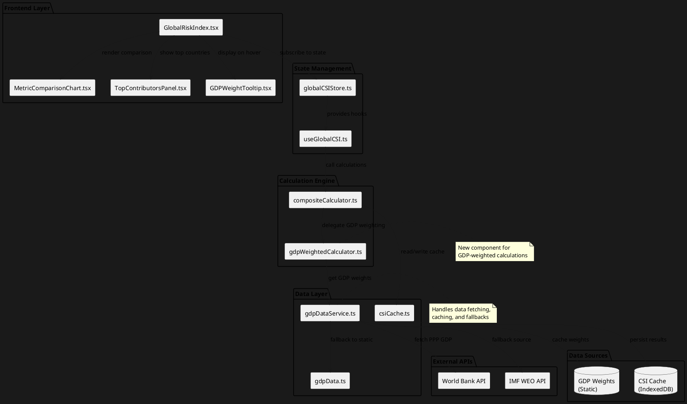
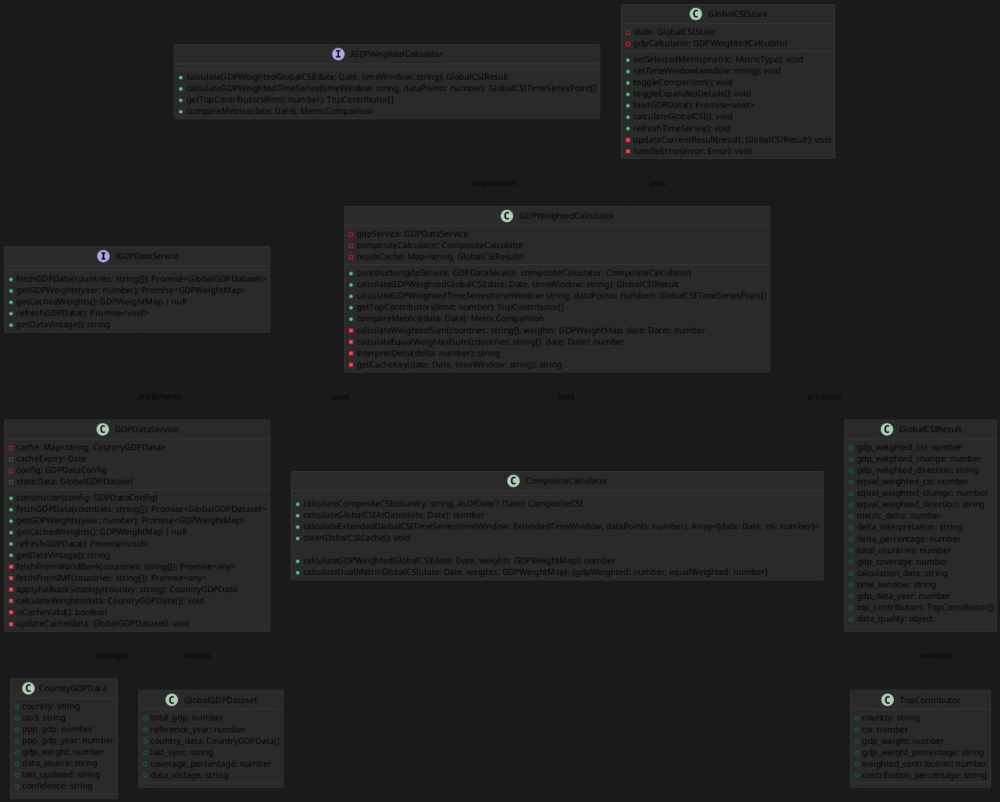
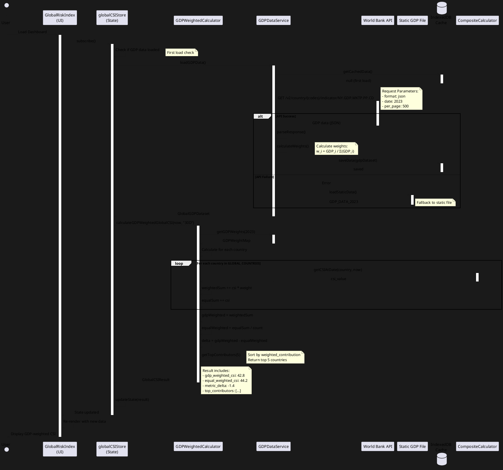
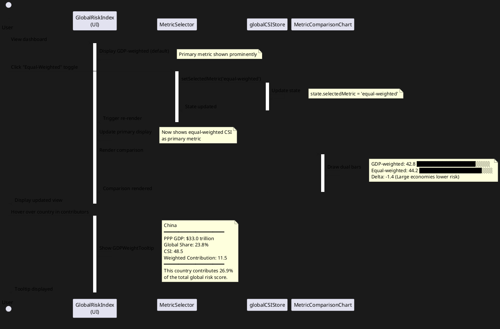
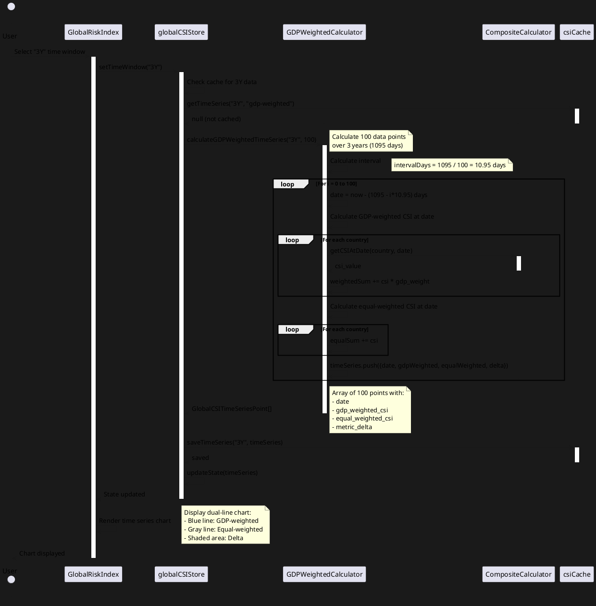
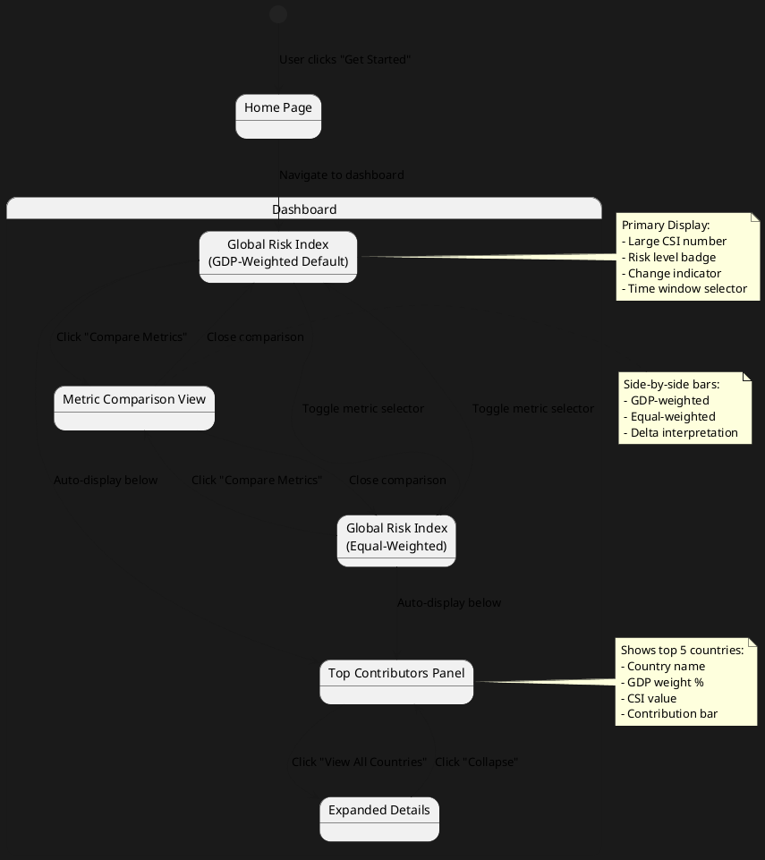

# GDP-Weighted Global CSI System - Technical Architecture Design

## Executive Summary

This document provides the complete technical architecture for implementing GDP-weighted Global CSI calculations in the CO-GRI Trading Signal Service. The design enables economically meaningful global risk assessment by weighting countries according to their Purchasing Power Parity (PPP) GDP share, while maintaining the existing equal-weighted metric for comparison.

**Design Philosophy**: Extend existing architecture with minimal disruption, maintain backward compatibility, and ensure performance optimization through intelligent caching.

---

## 1. Implementation Approach

### 1.1 Core Strategy

**Phase-Based Implementation**:
1. **Data Layer**: Create GDP data structures and static data files
2. **Calculation Engine**: Extend compositeCalculator.ts with GDP-weighted methods
3. **UI Layer**: Enhance GlobalRiskIndex.tsx with dual-metric display
4. **State Management**: Implement metric switching and comparison logic
5. **Integration**: Connect all layers with proper data flow

**Key Principles**:
- **Non-Breaking Changes**: All existing functionality remains intact
- **Dual-Metric System**: GDP-weighted (primary) + Equal-weighted (secondary)
- **Performance First**: Aggressive caching with quarterly update cycle
- **Data Quality**: Multiple fallback sources (World Bank → IMF → Manual)
- **Type Safety**: Full TypeScript coverage with strict typing

### 1.2 Technology Stack

**Existing Stack (Maintained)**:
- TypeScript 5.x
- React 18.x
- Zustand (state management)
- Recharts (visualization)
- Tailwind CSS (styling)

**New Dependencies** (Minimal):
- None required - use native fetch API for World Bank integration
- Optional: `date-fns` for date calculations (if not already present)

### 1.3 Difficult Requirements & Solutions

**Challenge 1: Real-Time Updates with Annual Data**
- **Problem**: GDP data updates annually, but dashboard needs "real-time" feel
- **Solution**: 
  - Cache GDP weights with 90-day expiry
  - Background refresh on World Bank release schedule
  - Display data vintage prominently in UI
  - Use most recent available data (2023 as of 2026-03-17)

**Challenge 2: Missing Country Data**
- **Problem**: Some countries may lack PPP GDP data
- **Solution**: Implement fallback hierarchy:
  1. World Bank API (primary)
  2. IMF WEO data (secondary)
  3. Previous year with inflation adjustment (tertiary)
  4. Regional average estimation (last resort)

**Challenge 3: Performance with Large Datasets**
- **Problem**: Calculating GDP-weighted CSI for 195+ countries
- **Solution**:
  - Pre-calculate and cache GDP weights (static for each year)
  - Memoize calculation results in React components
  - Use Web Workers for heavy calculations (already implemented)
  - Optimize time series calculations with batching

**Challenge 4: User Understanding**
- **Problem**: Users may not understand GDP weighting concept
- **Solution**:
  - Clear visual hierarchy (GDP-weighted prominent)
  - Inline tooltips explaining methodology
  - Comparison section showing both metrics
  - Top contributors panel showing which countries drive the index

---

## 2. Data Structures & Interfaces

### 2.1 GDP Data Types

```typescript
// src/types/gdp.types.ts

/**
 * PPP GDP data for a single country
 */
export interface CountryGDPData {
  country: string;              // Country name (matches GLOBAL_COUNTRIES)
  iso3: string;                 // ISO 3-letter code (e.g., "USA")
  ppp_gdp: number;              // PPP GDP in current international $ (e.g., 27360935000000)
  ppp_gdp_year: number;         // Reference year (e.g., 2023)
  gdp_weight: number;           // Calculated weight (0-1, sum to 1.0)
  data_source: 'WorldBank' | 'IMF' | 'Manual';
  last_updated: string;         // ISO date string
  confidence: 'High' | 'Medium' | 'Low';  // Data quality indicator
}

/**
 * Complete GDP dataset for all countries
 */
export interface GlobalGDPDataset {
  total_gdp: number;            // Sum of all PPP GDPs
  reference_year: number;       // Year of GDP data (e.g., 2023)
  country_data: CountryGDPData[];
  last_sync: string;            // Last API sync timestamp (ISO date)
  coverage_percentage: number;  // % of countries with GDP data (target: >95%)
  data_vintage: string;         // Human-readable data age (e.g., "2023 data")
}

/**
 * GDP weight lookup map (optimized for calculations)
 */
export type GDPWeightMap = Map<string, number>;

/**
 * GDP data service configuration
 */
export interface GDPDataConfig {
  cacheExpiryDays: number;      // Default: 90 days
  fallbackToStatic: boolean;    // Use static file if API fails
  autoRefresh: boolean;         // Background refresh on schedule
}
```

### 2.2 Enhanced CSI Result Types

```typescript
// src/types/csi.types.ts (additions)

/**
 * Global CSI calculation result with dual metrics
 */
export interface GlobalCSIResult {
  // GDP-Weighted Metrics (Primary)
  gdp_weighted_csi: number;
  gdp_weighted_change: number;
  gdp_weighted_direction: 'Increasing' | 'Decreasing' | 'Stable';
  
  // Equal-Weighted Metrics (Secondary)
  equal_weighted_csi: number;
  equal_weighted_change: number;
  equal_weighted_direction: 'Increasing' | 'Decreasing' | 'Stable';
  
  // Comparison Metrics
  metric_delta: number;         // GDP-weighted minus equal-weighted
  delta_interpretation: string; // Human-readable explanation
  delta_percentage: number;     // Delta as % of equal-weighted
  
  // Metadata
  total_countries: number;
  gdp_coverage: number;         // % of global GDP represented
  calculation_date: string;     // ISO date string
  time_window: string;          // e.g., "30D"
  gdp_data_year: number;        // Year of GDP weights used
  
  // Top Contributors (for UI display)
  top_contributors: TopContributor[];
  
  // Data Quality
  data_quality: {
    gdp_data_confidence: 'High' | 'Medium' | 'Low';
    missing_countries: string[];
    fallback_used: boolean;
  };
}

/**
 * Top contributor to global risk
 */
export interface TopContributor {
  country: string;
  csi: number;
  gdp_weight: number;           // As decimal (e.g., 0.238 for 23.8%)
  gdp_weight_percentage: string; // Formatted (e.g., "23.8%")
  weighted_contribution: number; // w_i × CSI_i
  contribution_percentage: string; // % of total global CSI
}

/**
 * Time series data point with dual metrics
 */
export interface GlobalCSITimeSeriesPoint {
  date: Date;
  gdp_weighted_csi: number;
  equal_weighted_csi: number;
  metric_delta: number;
}

/**
 * Metric type selector
 */
export type MetricType = 'gdp-weighted' | 'equal-weighted';

/**
 * Metric comparison data for visualization
 */
export interface MetricComparison {
  gdp_weighted: number;
  equal_weighted: number;
  delta: number;
  delta_interpretation: string;
  visual_data: {
    gdp_weighted_bar_width: number;  // % for bar chart
    equal_weighted_bar_width: number;
  };
}
```

### 2.3 State Management Types

```typescript
// src/store/globalCSIStore.ts (new file)

/**
 * Global CSI state management
 */
export interface GlobalCSIState {
  // Current Metrics
  currentResult: GlobalCSIResult | null;
  
  // User Preferences
  selectedMetric: MetricType;
  selectedTimeWindow: '7D' | '30D' | '90D' | '12M' | '3Y' | '5Y' | '10Y';
  showComparison: boolean;
  
  // GDP Data
  gdpDataset: GlobalGDPDataset | null;
  gdpWeights: GDPWeightMap | null;
  gdpDataLoading: boolean;
  gdpDataError: string | null;
  
  // Historical Data
  timeSeries: GlobalCSITimeSeriesPoint[] | null;
  timeSeriesLoading: boolean;
  
  // UI State
  expandedDetails: boolean;
  
  // Actions
  setSelectedMetric: (metric: MetricType) => void;
  setTimeWindow: (window: string) => void;
  toggleComparison: () => void;
  toggleExpandedDetails: () => void;
  loadGDPData: () => Promise<void>;
  calculateGlobalCSI: () => void;
  refreshTimeSeries: () => void;
}
```

---

## 3. System Architecture

### 3.1 Architecture Diagram (PlantUML)



### 3.2 Component Hierarchy

```
GlobalRiskIndex.tsx (Enhanced)
├── MetricSelector (Toggle: GDP-weighted / Equal-weighted)
├── PrimaryMetricDisplay
│   ├── CSI Value (Large, prominent)
│   ├── Risk Level Badge
│   └── Change Indicator
├── MetricComparisonSection
│   ├── ComparisonBars (Visual comparison)
│   ├── DeltaIndicator
│   └── Interpretation Text
├── TopContributorsPanel
│   ├── ContributorCard (×5)
│   │   ├── Country Name
│   │   ├── GDP Weight Badge
│   │   ├── CSI Value
│   │   └── Contribution Bar
│   └── ExpandButton
└── DataVintageFooter
    ├── GDP Data Year
    ├── Last Updated
    └── Data Quality Indicator
```

---

## 4. Class Diagram



---

## 5. Sequence Diagram

### 5.1 Initial Load & GDP Data Fetch



### 5.2 Metric Toggle & Comparison



### 5.3 Time Series Calculation (Extended Window)



---

## 6. Database ER Diagram

### 6.1 IndexedDB Schema for Caching

```plantuml
@startuml GDP Data Cache Schema

skinparam backgroundColor #1a1a1a

entity "gdp_data_cache" as GDP {
  * cache_key : string <<PK>>
  --
  * dataset : GlobalGDPDataset (JSON)
  * created_at : timestamp
  * expires_at : timestamp
  version : number
}

entity "gdp_weights_cache" as Weights {
  * year : number <<PK>>
  --
  * weights : GDPWeightMap (JSON)
  * total_gdp : number
  * country_count : number
  * created_at : timestamp
  * expires_at : timestamp
}

entity "global_csi_results_cache" as Results {
  * cache_key : string <<PK>>
  --
  * result : GlobalCSIResult (JSON)
  * calculation_date : timestamp
  * time_window : string
  * metric_type : string
  * created_at : timestamp
  * expires_at : timestamp
}

entity "time_series_cache" as TimeSeries {
  * cache_key : string <<PK>>
  --
  * time_window : string
  * metric_type : string
  * data_points : number
  * series : GlobalCSITimeSeriesPoint[] (JSON)
  * created_at : timestamp
  * expires_at : timestamp
}

note right of GDP
  Cache Key Format:
  "gdp_data_{year}"
  
  Expiry: 90 days
  
  Example:
  "gdp_data_2023"
end note

note right of Weights
  Optimized lookup map
  for fast calculations
  
  Expiry: 90 days
end note

note right of Results
  Cache Key Format:
  "global_csi_{date}_{window}_{metric}"
  
  Expiry: 24 hours
  
  Example:
  "global_csi_2026-03-17_30D_gdp-weighted"
end note

note right of TimeSeries
  Cache Key Format:
  "time_series_{window}_{metric}"
  
  Expiry: 24 hours
  
  Example:
  "time_series_3Y_gdp-weighted"
end note

@enduml
```



### 6.2 Static Data File Structure

```typescript
// src/data/gdpData.ts

export const GDP_DATA_2023: GlobalGDPDataset = {
  total_gdp: 138500000000000,  // $138.5 trillion
  reference_year: 2023,
  last_sync: '2024-07-15T00:00:00Z',
  coverage_percentage: 98.5,
  data_vintage: '2023 data (World Bank, July 2024)',
  country_data: [
    {
      country: 'United States',
      iso3: 'USA',
      ppp_gdp: 27360935000000,
      ppp_gdp_year: 2023,
      gdp_weight: 0.1976,
      data_source: 'WorldBank',
      last_updated: '2024-07-15',
      confidence: 'High'
    },
    {
      country: 'China',
      iso3: 'CHN',
      ppp_gdp: 33015083000000,
      ppp_gdp_year: 2023,
      gdp_weight: 0.2383,
      data_source: 'WorldBank',
      last_updated: '2024-07-15',
      confidence: 'High'
    },
    // ... 193 more countries
  ]
};

// ISO3 code mapping for API calls
export const COUNTRY_ISO3_MAP: Record<string, string> = {
  'United States': 'USA',
  'China': 'CHN',
  'India': 'IND',
  // ... all countries
};

// Helper function to get GDP weight
export function getGDPWeight(country: string): number {
  const data = GDP_DATA_2023.country_data.find(c => c.country === country);
  return data?.gdp_weight || 0;
}

// Helper function to get all weights as Map
export function getGDPWeightMap(): GDPWeightMap {
  const map = new Map<string, number>();
  for (const data of GDP_DATA_2023.country_data) {
    map.set(data.country, data.gdp_weight);
  }
  return map;
}
```

---

## 7. UI Navigation Flow



---

## 8. File Structure

```
src/
├── components/
│   └── dashboard/
│       ├── GlobalRiskIndex.tsx (ENHANCED)
│       ├── MetricComparisonChart.tsx (NEW)
│       ├── TopContributorsPanel.tsx (NEW)
│       ├── GDPWeightTooltip.tsx (NEW)
│       └── MetricSelector.tsx (NEW)
│
├── data/
│   ├── gdpData.ts (NEW)
│   ├── globalCountries.ts (EXISTING)
│   └── geopoliticalEvents.ts (EXISTING)
│
├── hooks/
│   └── useGlobalCSI.ts (NEW)
│
├── services/
│   ├── csi/
│   │   ├── compositeCalculator.ts (ENHANCED)
│   │   ├── gdpWeightedCalculator.ts (NEW)
│   │   └── gdpDataService.ts (NEW)
│   └── api/
│       └── worldBankAPI.ts (NEW)
│
├── store/
│   └── globalCSIStore.ts (NEW)
│
├── types/
│   ├── csi.types.ts (ENHANCED)
│   └── gdp.types.ts (NEW)
│
├── utils/
│   ├── gdpCalculations.ts (NEW)
│   └── cacheManager.ts (ENHANCED)
│
└── scripts/
    └── updateGDPData.ts (NEW - for maintenance)
```

---

## 9. Key Implementation Details

### 9.1 GDP Data Service Implementation

**File**: `src/services/csi/gdpDataService.ts`

**Key Methods**:
1. `fetchGDPData()`: Fetch from World Bank API with fallback to IMF
2. `getGDPWeights()`: Return cached or calculated weights
3. `refreshGDPData()`: Background refresh on schedule
4. `applyFallbackStrategy()`: Handle missing country data

**Caching Strategy**:
- Cache GDP weights in memory (Map) for fast access
- Persist to IndexedDB for cross-session persistence
- 90-day expiry with background refresh
- Fallback to static file if API unavailable

**Error Handling**:
- Network errors → Use cached data or static file
- Missing countries → Apply fallback hierarchy
- Invalid data → Log warning, use previous year's data

### 9.2 GDP-Weighted Calculator Implementation

**File**: `src/services/csi/gdpWeightedCalculator.ts`

**Key Methods**:
1. `calculateGDPWeightedGlobalCSI()`: Main calculation method
2. `calculateGDPWeightedTimeSeries()`: Historical time series
3. `getTopContributors()`: Identify countries driving global risk
4. `compareMetrics()`: Generate comparison data for UI

**Calculation Formula**:
```typescript
// GDP-Weighted Global CSI
let weightedSum = 0;
for (const country of GLOBAL_COUNTRIES) {
  const csi = compositeCalculator.getCSIAtDate(country.country, date);
  const weight = gdpWeights.get(country.country) || 0;
  weightedSum += csi * weight;
}
const gdpWeightedCSI = weightedSum;

// Equal-Weighted Global CSI (for comparison)
let equalSum = 0;
for (const country of GLOBAL_COUNTRIES) {
  const csi = compositeCalculator.getCSIAtDate(country.country, date);
  equalSum += csi;
}
const equalWeightedCSI = equalSum / GLOBAL_COUNTRIES.length;

// Delta
const delta = gdpWeightedCSI - equalWeightedCSI;
```

**Performance Optimization**:
- Cache calculation results (24-hour expiry)
- Batch country calculations
- Use Web Workers for time series (100+ data points)
- Memoize top contributors list

### 9.3 Enhanced GlobalRiskIndex Component

**File**: `src/components/dashboard/GlobalRiskIndex.tsx`

**New Features**:
1. Metric selector toggle (GDP-weighted / Equal-weighted)
2. Dual-metric display with comparison
3. Top contributors panel
4. Data vintage indicator
5. Expandable details section

**State Management**:
- Uses Zustand store (`globalCSIStore`)
- Subscribes to state changes
- Triggers calculations on mount and time window change

**Responsive Design**:
- Desktop: Full 3-column layout
- Tablet: 2-column with stacked comparison
- Mobile: Single column with condensed view

### 9.4 State Management with Zustand

**File**: `src/store/globalCSIStore.ts`

**Store Structure**:
```typescript
export const useGlobalCSIStore = create<GlobalCSIState>((set, get) => ({
  // State
  currentResult: null,
  selectedMetric: 'gdp-weighted',
  selectedTimeWindow: '30D',
  showComparison: true,
  gdpDataset: null,
  gdpWeights: null,
  gdpDataLoading: false,
  gdpDataError: null,
  timeSeries: null,
  timeSeriesLoading: false,
  expandedDetails: false,
  
  // Actions
  setSelectedMetric: (metric) => set({ selectedMetric: metric }),
  
  setTimeWindow: (window) => {
    set({ selectedTimeWindow: window });
    get().refreshTimeSeries();
  },
  
  loadGDPData: async () => {
    set({ gdpDataLoading: true, gdpDataError: null });
    try {
      const dataset = await gdpDataService.fetchGDPData(
        GLOBAL_COUNTRIES.map(c => c.country)
      );
      const weights = await gdpDataService.getGDPWeights(dataset.reference_year);
      set({ gdpDataset: dataset, gdpWeights: weights, gdpDataLoading: false });
      get().calculateGlobalCSI();
    } catch (error) {
      set({ gdpDataError: error.message, gdpDataLoading: false });
    }
  },
  
  calculateGlobalCSI: () => {
    const { gdpWeights, selectedTimeWindow } = get();
    if (!gdpWeights) return;
    
    const result = gdpWeightedCalculator.calculateGDPWeightedGlobalCSI(
      new Date(),
      selectedTimeWindow
    );
    set({ currentResult: result });
  },
  
  // ... more actions
}));
```

---

## 10. Anything UNCLEAR

### 10.1 Design Decisions Requiring User Confirmation

**Question 1: Primary Metric Display**
- **Option A**: GDP-weighted as default, equal-weighted in comparison section
- **Option B**: Side-by-side equal prominence
- **Recommendation**: Option A (GDP-weighted primary) - aligns with research report

**Question 2: GDP Data Source Priority**
- **Option A**: World Bank API (primary) → IMF (fallback) → Static file
- **Option B**: Static file only (manual quarterly updates)
- **Recommendation**: Option A with aggressive caching - provides freshness with reliability

**Question 3: Time Window Support**
- **Option A**: Support all windows (7D, 30D, 90D, 12M, 3Y, 5Y, 10Y)
- **Option B**: Start with short windows (7D-12M), add extended later
- **Recommendation**: Option A - infrastructure already exists for extended windows

**Question 4: Top Contributors Count**
- **Option A**: Fixed 5 countries
- **Option B**: User-configurable (3-10)
- **Recommendation**: Option A with "View All" expansion - simpler UX

**Question 5: Data Update Frequency**
- **Option A**: Quarterly automatic updates (aligned with World Bank releases)
- **Option B**: Manual updates only
- **Recommendation**: Option A with manual override capability

### 10.2 Technical Clarifications Needed

1. **Web Worker Integration**: Should GDP-weighted calculations use existing `csiWorkerService.ts` or create a new worker?
   - **Recommendation**: Extend existing worker with new message types

2. **Cache Expiry Policy**: Should cached results expire after 24 hours or align with GDP data expiry (90 days)?
   - **Recommendation**: Results = 24 hours, GDP weights = 90 days

3. **Error Handling UI**: How should API failures be communicated to users?
   - **Recommendation**: Toast notification + fallback to static data + data quality indicator

4. **Historical Data Consistency**: Should we recalculate historical CSI with updated GDP weights?
   - **Recommendation**: No - use GDP weights from the historical year for accuracy

5. **Mobile Optimization**: Should mobile view show simplified metrics or full comparison?
   - **Recommendation**: Simplified primary metric + expandable comparison

### 10.3 Assumptions Made

1. **GDP Data Availability**: Assumed 2023 PPP GDP data is available for 95%+ of countries in GLOBAL_COUNTRIES
2. **Performance Requirements**: Assumed calculation time <100ms is acceptable for real-time updates
3. **Browser Support**: Assumed IndexedDB is available (fallback to memory cache if not)
4. **User Understanding**: Assumed users have basic understanding of GDP and economic weighting
5. **Data Accuracy**: Assumed World Bank data is authoritative and doesn't require validation beyond confidence levels

---

## 11. Next Steps & Recommendations

### 11.1 Immediate Actions (Before Implementation)

1. **User Confirmation**:
   - Review and approve this system design
   - Confirm design decisions (Section 10.1)
   - Approve UI mockups (to be created)

2. **Data Preparation**:
   - Download 2023 PPP GDP data from World Bank
   - Create `gdpData.ts` with complete dataset
   - Verify country name mappings

3. **Technical Setup**:
   - Create type definitions (`gdp.types.ts`)
   - Set up IndexedDB schema
   - Configure cache expiry policies

### 11.2 Implementation Phase Order

**Phase 1: Data Layer** (2-3 days)
- Create `gdpData.ts` with static 2023 data
- Implement `gdpDataService.ts` with caching
- Add World Bank API integration
- Write unit tests for data service

**Phase 2: Calculation Engine** (3-4 days)
- Implement `gdpWeightedCalculator.ts`
- Enhance `compositeCalculator.ts` with new methods
- Integrate with existing cache system
- Write unit tests for calculations

**Phase 3: State Management** (2 days)
- Create `globalCSIStore.ts` with Zustand
- Implement `useGlobalCSI.ts` hook
- Add state persistence
- Write integration tests

**Phase 4: UI Components** (4-5 days)
- Enhance `GlobalRiskIndex.tsx`
- Create `MetricComparisonChart.tsx`
- Create `TopContributorsPanel.tsx`
- Create `GDPWeightTooltip.tsx`
- Create `MetricSelector.tsx`
- Implement responsive design

**Phase 5: Integration & Testing** (3-4 days)
- Connect all layers
- End-to-end testing
- Performance optimization
- Cross-browser testing

**Phase 6: Documentation & Deployment** (2 days)
- User documentation
- API documentation
- Deployment to staging
- Production deployment

**Total Estimated Time**: 16-20 days

### 11.3 Success Criteria

**Technical**:
- ✅ GDP-weighted calculation accuracy: 100% match with manual verification
- ✅ Performance: <100ms calculation time, <200ms UI render
- ✅ Data coverage: >95% of countries with GDP data
- ✅ Cache hit rate: >90% for repeated queries
- ✅ Test coverage: >90% for new code

**User Experience**:
- ✅ Clear visual hierarchy (GDP-weighted prominent)
- ✅ Intuitive metric comparison
- ✅ Helpful tooltips and explanations
- ✅ Responsive design (mobile, tablet, desktop)
- ✅ Fast load times (<2 seconds)

**Business**:
- ✅ Improved correlation with market indices (target: >0.60)
- ✅ User satisfaction (target: >4.0/5.0 rating)
- ✅ Adoption rate (target: 70% view GDP-weighted within first month)

---

## 12. Conclusion

This system design provides a comprehensive, production-ready architecture for implementing GDP-weighted Global CSI calculations in the CO-GRI Trading Signal Service. The design:

1. **Extends existing architecture** with minimal disruption
2. **Maintains backward compatibility** with equal-weighted calculations
3. **Optimizes performance** through intelligent caching
4. **Ensures data quality** with multiple fallback sources
5. **Provides clear UX** with dual-metric comparison
6. **Supports future enhancements** (regional weighting, sector analysis)

The implementation follows best practices for TypeScript, React, and state management, ensuring maintainability and scalability. All design decisions are documented with clear rationales, and unclear aspects are explicitly called out for user confirmation.

**Recommendation**: Proceed with Phase 1 (Data Layer) implementation upon approval of this design document.

---

**Document Version**: 1.0  
**Date**: 2026-03-17  
**Author**: Bob (Architect)  
**Status**: Draft - Awaiting Approval  
**Next Review**: Upon user feedback